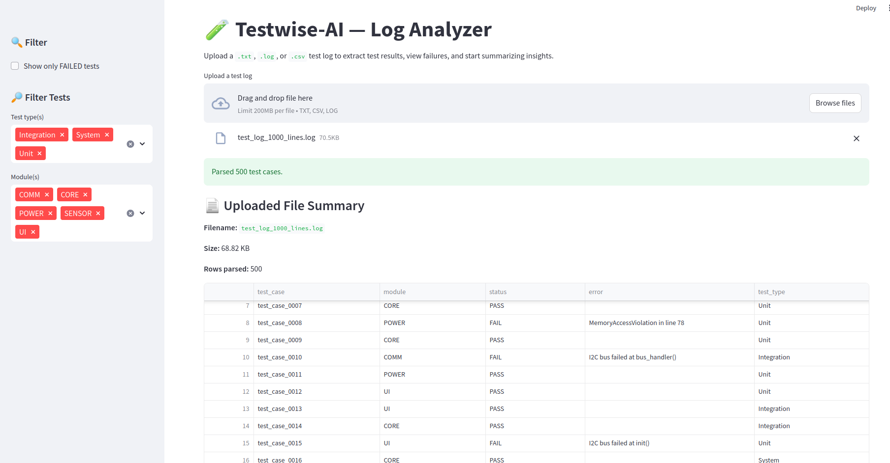
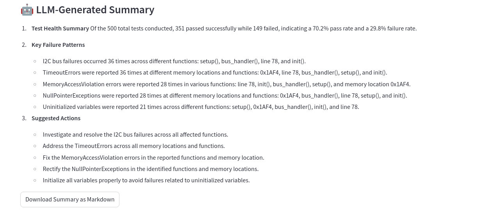
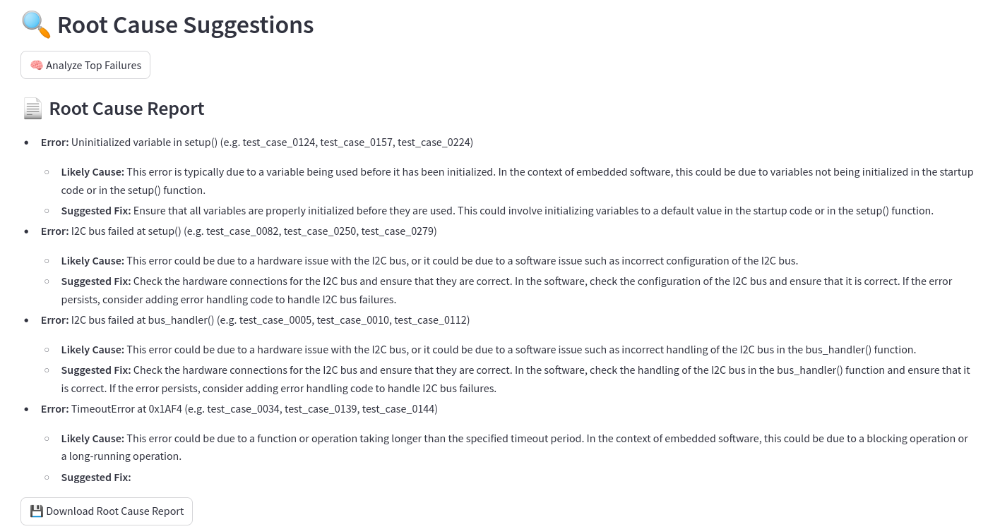
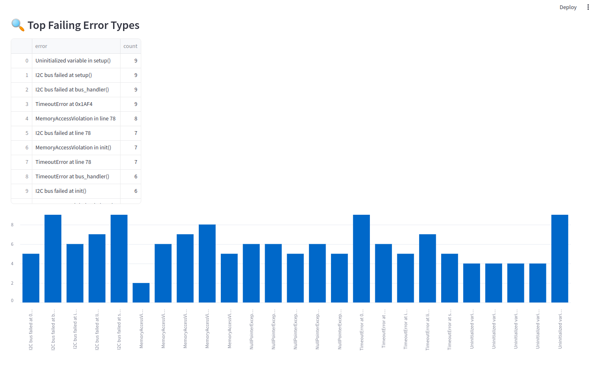

# 🧪 Testwise-AI

[](https://shields.io/)

Testwise-AI is an AI-powered assistant for **analyzing embedded system test logs** — built for automotive and avionics environments where certification testing generates large volumes of results.

This project demonstrates **log parsing, summarization, GPT-powered analysis, and PDF/Markdown reporting** in an interactive Streamlit web app.

---

## ✨ Features

- 📂 **Upload & Parse Logs** — Supports `.txt`, `.log`, `.csv`
- 📊 **Interactive Filtering** — Filter results by **test type**, **module**, and **status**
- 🤖 **GPT Summaries** — Generate concise engineering summaries of test outcomes
- 🔍 **Root Cause Analysis** — GPT suggests likely causes and fixes for top failures
- 📈 **Charts** — View top error frequencies
- 📥 **Reports** — Download analysis as Markdown or PDF

---

## 🖼 Demo Screenshots

> *For security, GPT features are shown in screenshots rather than live deployment.*

**1️⃣ Log Upload & Parsing**


**2️⃣ GPT Summary Output**


**3️⃣ Root Cause Suggestions**


**4️⃣ Charts & Reports**


---

## 📂 Project Structure

```
app/
 ├── parser.py         # Parse .txt/.log/.csv test logs into a DataFrame
 ├── summary.py        # Summarize results & generate GPT summaries
 ├── root_cause.py     # Analyze top failures & suggest fixes
 ├── report_gen.py     # Generate Markdown/PDF reports
 └── ui.py             # Streamlit UI

tests/
 ├── test_parser.py        # Unit tests for parsing functions
 ├── test_report_gen.py    # Unit tests for report generation
 ├── test_root_cause.py    # Unit tests for root cause analysis
 ├── test_summary.py       # Unit tests for summary logic

requirements.txt       # Project dependencies
```

---

## 🛠 Tech Stack

| Component     | Technology |
|---------------|------------|
| UI            | Streamlit  |
| Parsing       | Python (pandas, regex) |
| LLM API       | OpenAI GPT-4 |
| Visualization | Plotly / Streamlit charts |
| Reports       | Markdown2 + pdfkit |

---

## 🚀 Local Setup

```bash
# Clone repo
git clone https://github.com/cristinamunteanu/testwise-ai.git
cd testwise-ai

# Create venv
python -m venv .venv
source .venv/bin/activate

# Install deps
pip install -r requirements.txt

# Run app
streamlit run app/ui.py
```

---

## 🔐 API Keys

Set your OpenAI API key as an environment variable:
```bash
export OPENAI_API_KEY="sk-..."
```

For Streamlit Cloud:
- Add your key via **Settings → Secrets** (do not commit keys to GitHub)

---

## 🧪 Testing

Run unit tests with coverage:
```bash
pytest --cov=app --cov-report=term-missing
```

Current coverage: **98%** — excludes UI rendering and rare error paths.

---

## 📜 License
MIT — free to use, modify, and distribute.

---

## 👤 Author
Built by [Cristina Munteanu] — Embedded software engineer transitioning into AI engineering.
